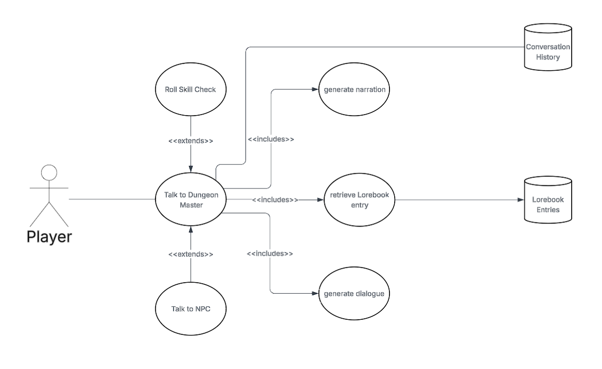

### Currently Implemented:

Rolling skill checks is the main thing currently implemented from the diagram, with the AI deciding wether a roll should be made and then rolling with the modifiers from the character sheet and then comparing that to the DC it set. On failure, the narration will describe the failure. On success, the AI will describe the success.